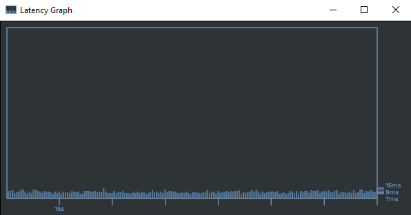

LatGraph - network latency real-time viewer
=======================================

This software allows you to monitor in real time your network latency using the UDP Echo protocol.

Usage
--------

First you'll your own remote UDP Echo server to test your latency to (unsurprisingly, I'm not aware of any public one). If you have a linux machine available you can use xinetd. If you just want to try out the software there is a test server available, run this command to see its usage:

    cargo run --features=test-server --bin test-echo-server -- --help

Once you have an echo server, you can run the main app with:

    cargo run -- -r 127.0.0.1:4207 -t 100

Where -r is the remote address and port of the echo server and -t is the delay between polls in milliseconds. See --help for additional options.

License
-------

LatGraph is distributed under the MIT license, see LICENSE.txt for details.

Some parts of `app.rs` are taken and modified from the [conrod](https://github.com/PistonDevelopers/conrod) examples, distributed under the MIT license.

`WorkSans-Regular.ttf` is from [Work-Sans](https://github.com/weiweihuanghuang/Work-Sans), distributed under the SIL Open Font License v1.1.